# Working Whitepaper for License-token.com
By the license-token.com team
Version: 0.87

## Table of Contents
  - [Introduction](#introduction)
  - [Executive Summary](#executive-summary)
  - [Motivation](#motivation)
  - [How it works](#how-it-works-simplified)
  - [Proposed Solution: Token-Based Licensing](#proposed-solution-token-based-licensing)
  - [Tokenomics](#tokenomics)
  - [Related Work](#related-work)
  - [Implications and Market Potential](#implications-and-market-potential)
  - [Roadmap](#roadmap)
  - [Conclusion](#conclusion)
  - [FAQ](#faq)
  - [References](#references)
  - [Disclaimer](#disclaimer)

## Introduction
In an era where open-source software (OSS) has become the backbone of technological innovation, contributing to an estimated $8.8 trillion in economic value, we face a paradox. While OSS drives significant cost savings and fosters innovation, the sustainability of these projects is increasingly at risk due to insufficient compensation for developers. 

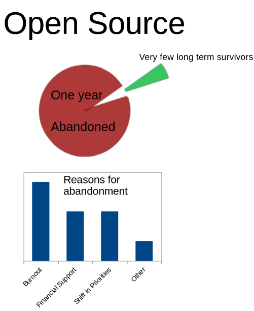

This often results in project abandonment (95%), leading to critical security vulnerabilities and additional economic burdens because 95% of used OSS is outdated due to these problems [[Open Source Software: The $9 Trillion Resource Companies Take for Granted - Harvard Business School](https://www.library.hbs.edu/working-knowledge/open-source-software-the-nine-trillion-resource-companies-take-for-granted/)].
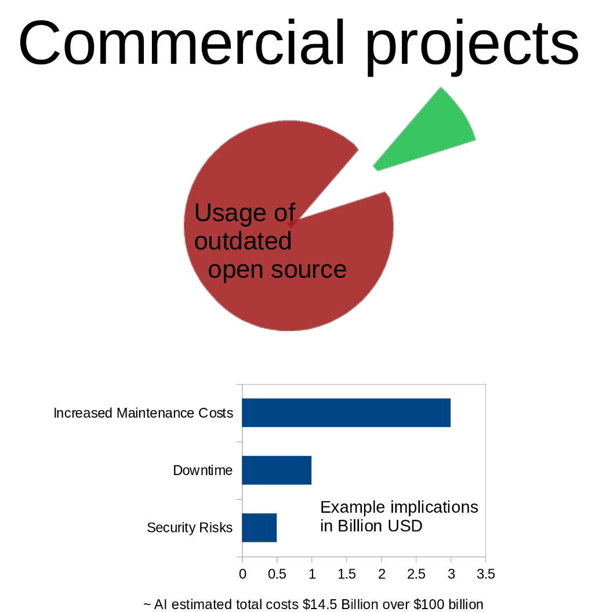

Non-Fungible Tokens (NFTs) are widespread in the Blockchain ecosystem, with established trading marketplaces. 
We introduce a new approach to software licensing and code ownership trading through smart contracts and NFTs, combined with a new Open Compensation Token License (OCTL). 

The implementation specifically leverages the Ethereum/Arbitrum network and is running there already as minimum viable product. 

This whitepaper outlines the vision, technology, and ecosystem of License-Token.com, aimed at revolutionizing how software royalty rights, copyrights are represented and transferred, and how software licenses are traded, managed, distributed, and validated.

This document draws on industry best practices and the following sources for foundational concepts:

---

## Executive Summary
License-Token.com aims to simplify and secure software licensing with token-based, non-fungible tokens (NFT). It represents software licenses and their validity on-chain and tokenizes source code copyright and royalty compensation rights via NFTs, leveraging existing marketplaces and implementations. 

The feasability of the approach can be verified by a first on-chain version and published source code of it.

This approach not only ensures the authenticity and ownership of source code and royalty receiving rights but also introduces flexibility and new business models for software development. 

Ultimately, the tokenization of licenses and code copyright fosters a new market. 
The key benefits of using blockchain technology for these cases include:

- **10X Scaling opportunity the NFT market through new actors**
- **Market for Code Ownership**
- **Funding Market for Software Development**
- **Secondary Market for License Trading**
- **Micro-Fragments Code Licenses**
- **Removing the Necessity of Trust in Collaborations between Developers**
- **Automated Licensing Management**

---

## How it works (simplified)
Model software licensing like music industry royalties: 
Publish your "code" and charge for the commercial plays - also if it is used in recompositions.

1. Copy the license text into your project and accept the license
2. You accept the shoulders your work stands on. Accept the story points of the work you are building (forks, libraries) on for the revenue split.  Otherwise change your dependencies.
2. Associate story points as efforts to your own work. 
3. Mint a Code Token for your work. 
4. Share the ID of the Code Token for others to reference and to issue Granted Licenses.

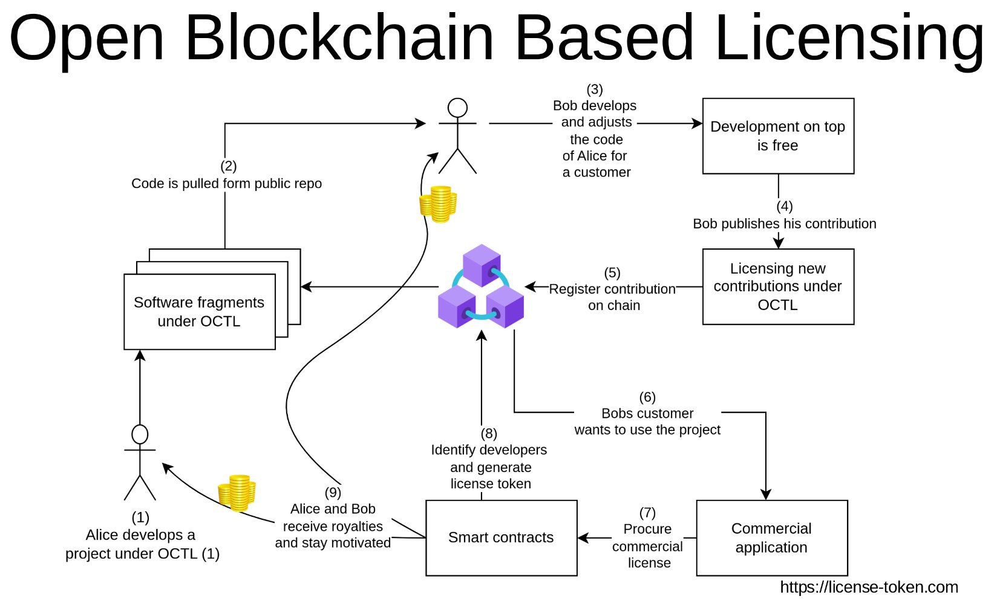

---

## Motivation
In the following, we are illustrating the paradox why open-source development struggles so much, even that there is a high industry demand for it. 

### Problems of Traditional Open Source
The OSS Licensing, while fostering collaboration and accessibility, faces challenges in financially supporting innovative projects, particularly those requiring significant initial investment or ongoing development. 

Here's why traditional OSS business models are often unsuitable for new innovation projects, leading ultimately to an abandonment rate of 95%.

**1. Foundation Support, Grants, Donations**
Funding comes from corporate sponsorships or grants, where companies or institutions invest in the project for strategic, CSR, or community-building reasons.  

Only 0.002% of all OSS projects might have the opportunity to be sponsored by an open source foundation when one considers the amount of Github repositories [[GitHub's State of the Octoverse 2022](https://octoverse.github.com/2022/top-programming-languages), [Linux Foundation Projects](https://www.linuxfoundation.org/projects/), [Apache Projects](https://projects.apache.org/), [Eclipse Projects](https://projects.eclipse.org/), [CNCF Projects](https://www.cncf.io/projects/). [Mozilla Projects](https://www.mozilla.org/en-US/foundation/moss/), [OSGeo Projects](https://www.osgeo.org/projects/)]. 

Additionally, Open Source Foundations sponsor projects when they meet certain conditions. Commonly, projects must be open source, have an active community, show technical merit, have clear governance, good documentation, legal and ethical compliance, align with the foundation's goals, go through an application process, potentially an incubation period, and commit to ongoing standards
[[Understanding Open Source Licenses - Open Source Initiative](https://opensource.org/licenses),
[What Makes a Successful Open Source Project? - Apache Software Foundation](https://www.apache.org/foundation/how-it-works.html),
[Joining the Linux Foundation](https://www.linuxfoundation.org/projects/joining/),
[CNCF Project Proposal Process](https://github.com/cncf/toc/blob/main/process/project_proposals.adoc),
[Eclipse Development Process](https://www.eclipse.org/projects/dev_process/development_process.php),
[Mozilla's Mission and Principles](https://www.mozilla.org/en-US/mission/),
[Best Practices for Open Source Development - GitHub](https://opensource.guide/best-practices/)].

Ultimately, the payment of open source sponsoring is not competitive with market-based payment [[The Value of Open Source Software is More than Cost Savings](https://www.linuxfoundation.org/blog/the-value-of-open-source-software-is-more-than-cost-savings/),[Open Source Software Creators: It’s Not Just About the Money | NBER](https://www.nber.org/digest/jul14/w20055.html)]. 

For new projects which need to monetize quickly, it can be challenging to meet the terms and conditions of an OSS foundation, relying on quick income to ensure the project's survival. Furthermore, even established projects often have problems complying with foundation-based funding due to their customer structure, business model, and the requirement to pay corporate-competitive salaries to their developers. 

Securing corporate grants often requires proving the project's value or potential impact, which can be challenging for new innovations without a track record. Additionally, reliance on these funding sources can lead to dependency and potential misalignment with project goals if sponsors have their agendas.

Ultimately, all grant-based funding can be seen as conditional donations.

Donations as a primary business model are fraught with challenges, primarily due to their unpredictability, which complicates financial planning [[Social Preferences, Self-Interest, and the Demand for Redistribution](https://www.sciencedirect.com/science/article/abs/pii/S0047272711000135)]. The lack of control over donation amounts and timing, as they depend heavily on donor sentiment, economic conditions, or special events, further undermines their reliability [[Impure Altruism and Donations to Public Goods: A Theory of Warm-Glow Giving](https://www.jstor.org/stable/2234133)]. Moreover, scaling operations based solely on donations is problematic because there's no assured increase in revenue with project growth or increased user base [[Perceptual Determinants of Nonprofit Giving Behavior](https://www.sciencedirect.com/science/article/abs/pii/S0148296399000945)]. Additionally, sustaining donor motivation over time is challenging; donors might not feel compelled to give repeatedly, risking long-term sustainability [[A Literature Review of Empirical Studies of Philanthropy: Eight Mechanisms That Drive Charitable Giving](https://journals.sagepub.com/doi/abs/10.1177/0899764010380927)]. These factors collectively highlight why donations alone cannot serve as a robust business model for organizations seeking stability and growth.

Looking at the foundation-sponsored numbers, conditions for donations and corporate grants, for most, especially new and innovative projects, all these options are not rational for project sustainability.  

**2. Open Core Model**  
The idea is to publish only a part of the code publicly. The fundamental version of the software is released under an open-source license, while advanced or enterprise-specific features are sold under a commercial license.  

In concrete SaaS application, this is also called Freemium. Basic functionality is provided for free on the OSS code, while premium features or enhanced capabilities are offered for a fee [[Slack's Freemium Model](https://slack.com/pricing),[GitHub's Pricing](https://github.com/pricing)].

This model often requires an established product with a mature user base to effectively monetize premium features. New, innovative projects might not yet have this base, making it difficult to generate revenue from advanced features without first establishing a significant free user community. There's also the risk that early adopters might not see the value in paying for additional features if the core product is still in development or evolving.

Ultimately, even large open-source projects struggle with this business model as even their published core might be copied by large SaaS providers [[MongoDB's Open Core Strategy](https://www.mongodb.com/blog/post/mongodb-open-core-strategy),[Elastic's Business Model](https://www.elastic.co/blog/elastic-business-model)]

**3. Software as a Service (SaaS)**  
The code is provided as a cloud-hosted service where users pay for access, convenience, or additional capabilities.  

New innovations are often small, easy to replicate, which puts their creators who need monetary support urgently into difficult situations. While open source can accelerate development, it also potentially gives copycats insight into the unique features with the possibility to easily clone the development [[Is it a good idea to build an Open Source Simple Analytics alternative?](https://www.indiehackers.com/post/is-it-a-good-idea-to-build-an-open-source-simple-analytics-alternative-604cbb6edb)].

**4. Support and Services**  
Revenue is generated by offering professional services around the open-source product, including support, consulting, training, or custom development [[Red Hat's Business Model](https://www.redhat.com/en/about/business-model),[Canonical's Support Offering](https://canonical.com/services)].

For new projects, there is commonly not enough demand for services like support or consulting due to a smaller or less committed user base, and publishing the code is not creating any business model at all [[There is Still NO Open Source Business Model](https://medium.com/@stephenrwalli/there-is-still-no-open-source-business-model-8748738faa43)]. Ultimately, publishing the code is then a mixture of trying to sell support for donations or selling support whereas the code could be directly delivered to customers instead.

**5. Advertising and Data Monetization**  
Revenue is generated through advertisements displayed within the software or by selling anonymized user data or insights.  

For new projects, user bases are typically small, reducing the value of advertising or data. Additionally, innovations often aim to gain trust through privacy and security features, which could be compromised by this model, deterring potential users [[Mozilla's Advertising Experiments](https://blog.mozilla.org/blog/2019/02/21/firefox-now-offers-more-choices-for-tracking-protection/)].

#### Anonymous Open Source Contributions
When considering the integration of open-source software from anonymous sources, several legal and practical issues arise, particularly in light of how employment laws around the world treat intellectual property (IP) rights.

In many legal systems, creators retain moral rights like the right to be recognized as the author even if commercial exploitation rights have been transferred to another party. Non-explicit agreements or permissions can conflict with these rights or lead to ethical debates about credit and recognition.

Across different jurisdictions like Germany, the U.S., India, the UK, and China, there's an underlying principle where employees generally create IP that belongs to their employer, either through copyright or patent law, or by contractual agreement [[Employment Law in Germany: In-depth](https://app.croneri.co.uk/topics/employment-law-germany/core-areas)]. 

This is especially true if the code was developed using company resources or insights that are not publicly available. An employer or another party might later claim rights over the code, leading to legal disputes or the need to remove the code from the project, which could disrupt development and trust in the project's stability. To accept such contributions, one would need to know the employment status or verification of the employer. This means that a contributor to many projects would need to verify with each project that they are even allowed to contribute employer-wise, which becomes very impractical when there are many projects.

Hence, without knowing the contributor, it's challenging to ascertain if the code was developed independently or within the scope of employment, potentially leading to ownership disputes.

Furthermore, with an unknown anonymous contributor, it's hard to ensure the code's quality or to hold someone accountable for issues. This anonymity can be exploited to introduce malicious code or bugs, either intentionally or through negligence.

### Micro Snippets and AI Code Generation
The potential of (AI-generated) code snippets is immense.

On one hand, AI coding assistants are trained with OSS code, leading to questions about under which license the resulting code snippets are. Furthermore, generated code might itself be adjusted for new AI training; therefore, the adjusted snippet needs to be seen as a contribution on top of the former, and both authors share the copyright of the AI output. Allowing proper and documented licensing of stacked contributions and generation is key to motivating people to offer their code for AI training. 

On the other hand, there are plenty of gist code snippets. Already for those, the potential of licensing creates large impacts on software development [[Parker, S. (2022). *Community Review as a Quality Assurance Mechanism*. Software Quality Journal.](https://www.researchgate.net/publication/359990465_Community_Review_as_a_Quality_Assurance_Mechanism),[White, E. (2022). *Tools for Managing Code Snippet Licenses*. Proceedings of the International Conference on Software Engineering.](https://ieeexplore.ieee.org/document/9793713)]. Market-wise, if developers could monetize their snippets, it could foster new SaaS models focused on code snippet management and utilization [[Smith, R. (2020). *Monetizing Code through Licensing Models*. Software Economics.](https://www.sciencedirect.com/science/article/pii/S0167642320301235),[Johnson, K., & Lee, H. (2021). *SaaS Models for Code Sharing Platforms*. Business Innovation Journal.](https://www.researchgate.net/publication/355628089_SaaS_Models_for_Code_Sharing_Platforms)].

Ultimately, the legal use of code snippets for training requires careful consideration of licensing. Compensation questions how the original open-source authors are compensated when code generation or manual snippet use happens and to keep up their motivation remains open. What we can say for certain is that the evolution of tools to manage licensing at the snippet level will be crucial for this potential to be fully realized [[White, E. (2022). *Tools for Managing Code Snippet Licenses*. Proceedings of the International Conference on Software Engineering](https://example.com/white2022)].

### Licensing Challenges
Traditional software licensing methods suffer several shortcomings:

- **Uniform Way to Trade Licenses**: Licenses are not defined in a uniform, exchangeable standard that can be used for trade and product access. 
- **End User Library Licensing**: Often, software products consist of many libraries, and once a user procures a license for one product, they pay again for the same library when they procure another product, even though in theory, a license was already procured.
- **Trust Requirement for Merges**: When contributions are merged into the code, the copyright or usage rights are often transferred to the receiving party, which makes complex contributor license agreements necessary, preventing contributions. 
- **License Piracy and Management Overhead**: Printed certificates or non-publicly ascribed licenses naturally lead to piracy and similar issues. This makes it complex and costly for businesses to manage and verify licenses. The sheer complexity of these processes makes it nearly impossible for small developers or projects to license their code because they cannot adhere to the compliance processes of larger entities.
- **Inflexibility**: Traditional licenses often do not adapt to modern, dynamic usage scenarios like cloud computing or multi-user environments, and especially small projects do not have the capability to create their own licenses.
- **Free and Commercial Licensing by Default**: Many developers do not mind sharing their code as long as nobody exploits their work without compensation. Hence, commercial licensing is normally only desired once commercial exploitation with real revenue happens. Today's open-source licensing demands full exploitation rights for everyone, which does not align with the common key goals of most developers.  
- **Forking and Productization**: Developers are in the dilemma that they normally want their product forked, but at the same time, exploitation by forkers should be prevented. The desire in licensing would be: Developer Alice codes a solution. Developer Bob builds on top, and customer Charlie procures Bob's code. The desire is that when the license for B is generated, A is compensated automatically. We have some drawing for that—let me check. At the moment, open-source licenses prohibit such restrictions. 
- **Community and Shared Interest Based**: Copycats will always exist as long as there is public code. Proving ownership combined with forking and commits on top, combined with shared compensation, is essential to build a community and create acceptance. Patents are also public but allow legal prosecution. A community sharing copyrights can prosecute violations together more effectively than individuals. At the moment, OSS licenses do not fulfill these demands because the OSS foundations, members, and sponsors, and developers who apply the licenses do not form a community of shared financial interest. 

### Sum up Requirements

- **Uniform Way to Trade Licenses**: Licenses should be defined in a uniform, exchangeable standard for trading and product access.

- **End User Library Licensing**: Solutions should manage licenses for libraries so that users are not repeatedly charged for the same library across different products.

- **Trust Requirement for Merges**: Licensing must facilitate easy merging of contributions without complex contributor license agreements, ensuring clear transfer of copyright or usage rights.

- **License Piracy and Management Overhead**: Modern solutions need to reduce piracy and simplify license management, making it feasible for small developers or projects to license their code without extensive compliance processes.

- **Inflexibility**: Licensing should adapt to modern scenarios like cloud computing or multi-user environments, with the capability for small projects to create their own licenses.

- **Free and Commercial Licensing by Default**: A system where code can be shared freely but with automatic compensation when commercially exploited.

- **Forking and Productization**: 
  - Developers should be able to fork projects but with mechanisms to ensure compensation for original developers when their work is commercially exploited by others.
  - Licensing should allow for automatic compensation to original authors when their code is used in subsequent products or forks.

- **Community and Shared Interest Based**: 
  - Licensing solutions should foster community collaboration by proving ownership, allowing forking and contributions, while ensuring shared financial benefits for all contributors.
  - The system should support collective enforcement of copyrights against violations, similar to how patents work, but within the open-source community context.

- **Verified Identity**: 
  - Implement mechanisms for verifying contributor identities to ensure legal compliance and to attribute contributions correctly, balancing this with privacy concerns.

- **Anonymous Contributions**: 
  - Support anonymous contributions while ensuring they don't compromise the integrity of the project, possibly through use of zero-knowledge proofs or other privacy-preserving technologies.

- **Validation of Potential Employee Permission**: 
  - Systems must validate if contributors have the necessary permissions from their employers to contribute code, especially in cases of anonymity, to prevent legal issues around intellectual property and employment contracts.

---

## Proposed Solution: Token-Based Licensing

We propose the solution to combine three elements to overcome the current problems:

- **1. A Uniform Fair Code License**: A fair code license allowing free usage and further development of source code, demanding compensation and attribution when commercial exploitation happens.
- **2. The License Linking to Blockchain Artifacts**: The license (1) shall link code, copyright, and usage licenses to a blockchain-based implementation, preferably NFTs.
- **3. A Smart Contract, Linking Code to the Blockchain**: The smart contract shall link source code, the associated copyright, and royalty rights defined in the license (1) to blockchain artifacts, preferably NFTs.
- **4. Software License Blockchain Representation**: Software licenses for compensation and attribution of different use cases shall be represented as blockchain artifacts, preferably NFTs.
- **5. A Smart Contract-Based Software License Procurement Mechanism**: A mechanism shall generate software license tokens (4) for use cases and associate them with code artifacts (3).
- **6. A Smart Contract-Based Funds Distribution Mechanism**: When software license tokens (4) are generated, the compensation of the token holders of linked code (3) shall happen. 
- **7. A Fund Holding Development Sponsoring Token**: A token shall be defined which can be loaded with funds to sponsor a certain development item, which can then be transferred or swapped with successfully developed code on the blockchain (3). Preferably, this token shall be an NFT. 

### Detailed Discussion of the Solution Elements:

#### Open Token Compensation License (OCTL)

- **Purpose**: The OCTL is designed as a fair code license to enable developers to earn royalties from their software contributions through a transparent, blockchain-based system. The license fosters free development on top of existing code, and only commercial use requires compensation. The required compensation is defined by use cases which direct to the concrete Blockchain implementation.
- **Mechanism**: Developers or contributors apply the license to their code like any other OSS license. They can thereby choose to tag code artifacts to group multiple commits together or to register commits as theirs on the blockchain.
- **Future License Development**: Over time, the OCTL will be refined and improved. The goal is that international differences in royalty compensations are made compatible on the license and implementation level. 
- **Potential Tax Settlement**: The license points out that licensee and licensor (in case the developer did not transfer the code token) are obligated to pay potential taxes, such as withholding tax or income tax, to keep the first version simple.

#### Code Tokens / Copyright Licensables:
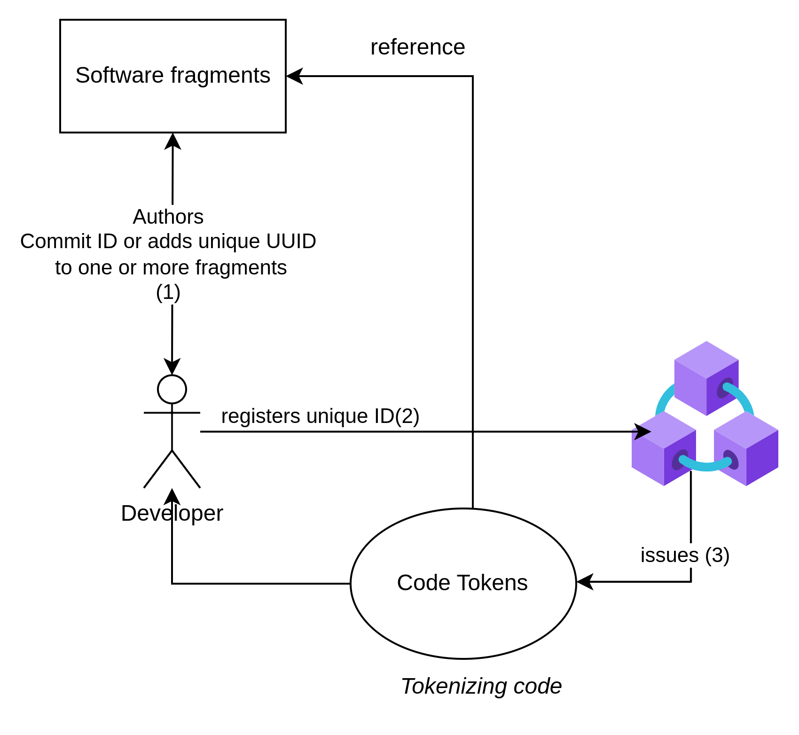
Code tokens are NFTs created by a smart contract and represented as extended ERC-721 NFTs. They are used to "link" dependent code artifacts. This linking can be to parent commits but also libraries that are pulled by dependency management, which is not viewable by git history. To do so, the Code Tokens support different code artifact "Contribution URIs" to represent groups of commits, the usage of libraries, etc..
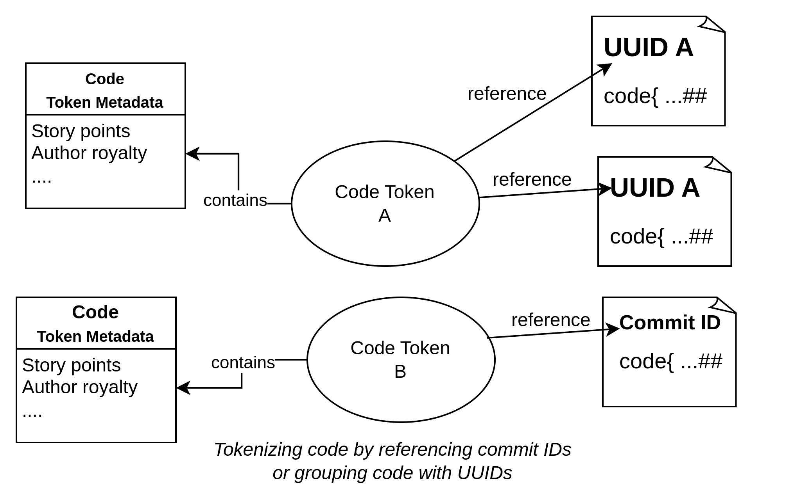
They have the following features:

##### Features of Code Tokens
- **Transferability**: A token can be transferred to other entities who then subsequently benefit from licensing royalties.
- **Creator Royalty**: A creator of these tokens might create a royalty when they are traded or the code gets licensed. One can imagine writing a piece of code and selling the majority of the rights on a marketplace because one sees their own key capability in coding. The buying entity then finds customers who license the code, and from this licensing, the original creator gets a fraction. 
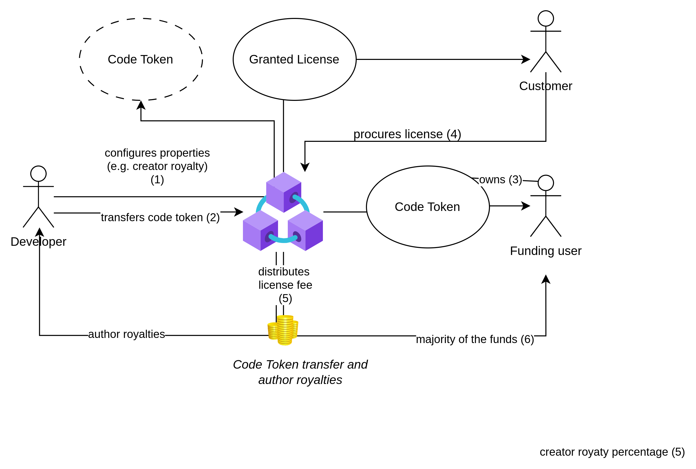
This allows everyone to focus on what they do best. The implementation has the capability that a creator can set the creator royalty to 0 and even fixate it.
- **Nesting**: Code tokens can be nested and unnested to group multiple tokens together for easier management. 
- **Story Points**: Each token can have a story point definition indicating the hours of work required for the code. Code tokens defining themselves as dependent on other code tokens indicate the acceptance of those story points. 
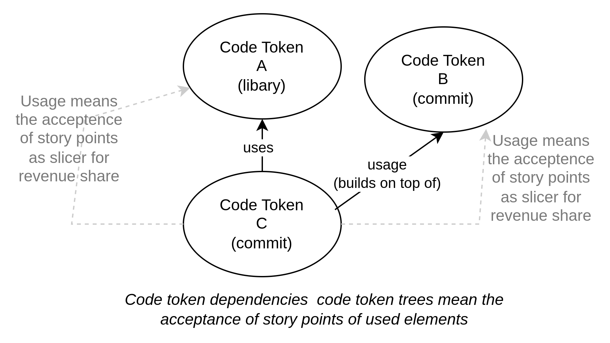

##### Remarks
In the moment, we see the nesting, the creator royalty, and bad actor behavior prevention as key factors to optimize and simplify this concept in the future. We believe it is best to advance this together with a community of early adopters.  

#### License Token / Granted License (GL):

GL for Licensees can be issued from the smart contract in the form of extended ERC-721 NFTs, ensuring they are immutable and verifiable. 

The demanded compensation in the case of commercial use shall be a defined percentage of the development costs for each end user or agent who triggers the code to be executed.

Generally, the story points of Code Tokens are used as distribution factor for license costs. In cases of forks that works like the following:
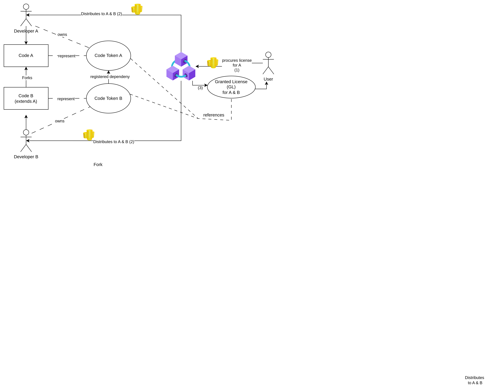

##### Version 1 License Fee Computation and Collection

In version 1, the license fee shall be computed with a simple supply-side formula, crediting effort, and be paid in ETH. A story point is attributed with 70 USD. 

In issuing a GL, all dependent contributions' story points are summed up, then multiplied by 70 (assumed hour price), divided by 3000 (assumed ETH price), and multiplied by 0.01 (for one percent). Thereby, the creator royalty for each contribution is computed, and at the end, a 1% OCTL sustainability fee is subtracted. 

Dependent artifacts are then baked together with a license validity for one year into a new NFT. Once a GL is issued, it is bound to the user's Ethereum address. The transferability is blocked in the first version, but in subsequent ones, the GL can then be traded like any other NFT at marketplaces.

##### Data of a Granted License
A GL shall contain specific data that is:
- **Country of Licensee**: Required so actors can fulfill their tax obligations transparently. 
- **Expiration Date of the License**: Validity is a key requirement when the code is used in SaaS or similar productive solutions because the pure development is free of charge.
- **Associated Code Tokens/Licenseables**: The contributions (Code Tokens/Licenseables) for which the license is valid. 
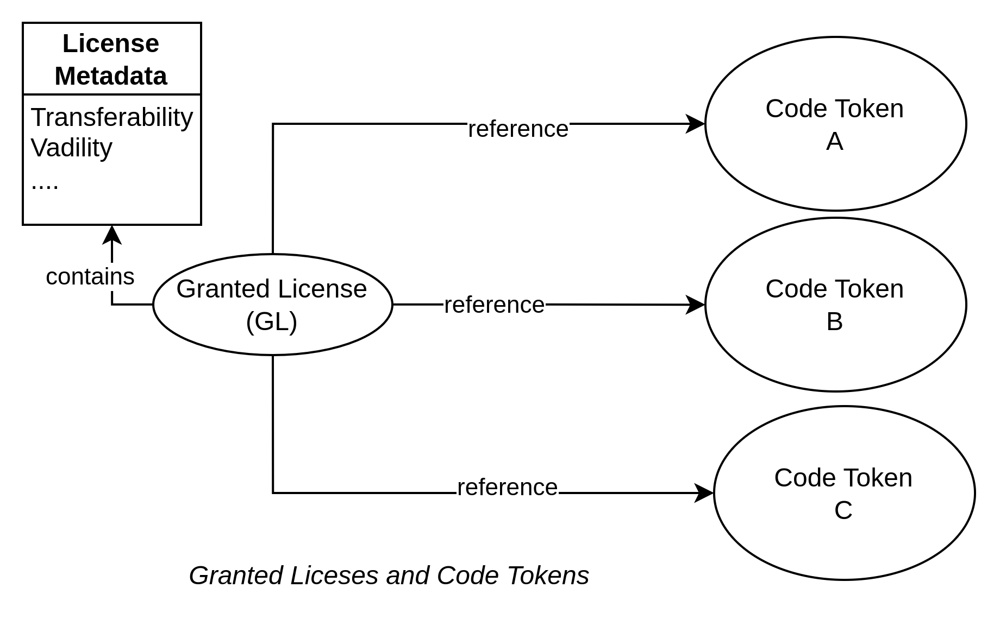
- **Transferability and Number of Allowed Subsales**: Indicator if a license can be resold and, if yes, how often. Positive numbers are decremented each time there is a transfer until 0 - then it is not transferable anymore. -1 indicates infinite transfers.
In order to ensure a fairness when licenses are transferred, the sales of licenses imposes royalties for the referenced Code Token owners.
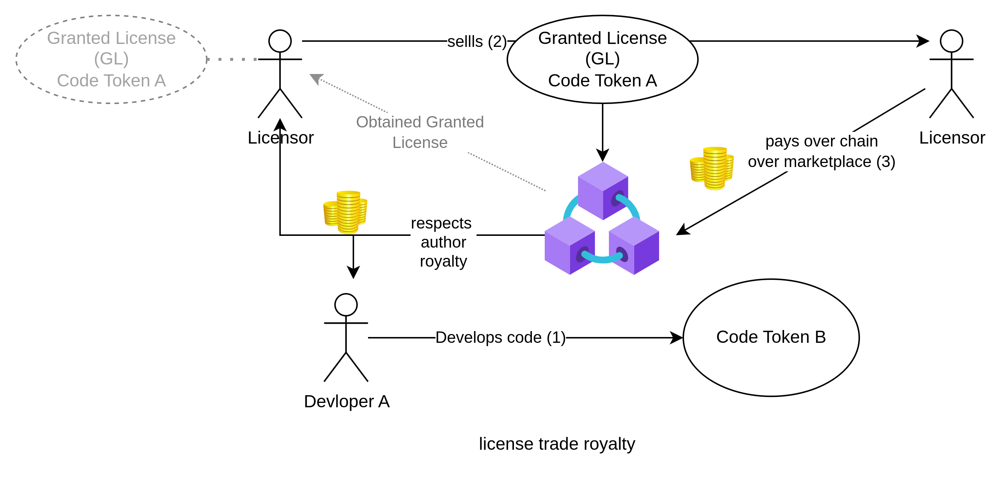

##### Remarks
Further capabilities of the license tokens and optimizations for issuance gas consumption (e.g., growing dependency trees) shall be worked on with the community. In particular, there shall be a discussion if supply-side pricing (e.g., development costs)] or demand-side pricing shall be the future foundation of the licensing fees. Furthermore, it's a question if the licensing function should only be open to OCTL projects and if end customers need to procure licenses from NFT marketplaces.

#### Development Stories:

Development stories are NFTs that can store (time) locked collateral. 

They allow participants to store funds in them to swap them for Code Tokens or transfer them (including the funds) to Code Token owners or for future GL of code tokens in development.

This allows sponsoring development in new forms. For example, a sponsor can request a certain feature and offer a development token as a bounty. Once a developer creates the implementation and the code token, a swapping is possible. 

Alternatively, a developer can swap a bundle of GL for the new Code Token. With all smart contract possibilities and the options to create author royalties, etc., sponsoring development in a cooperative way ensures that both the sponsor and the developer create a win-win from the sponsorship. 
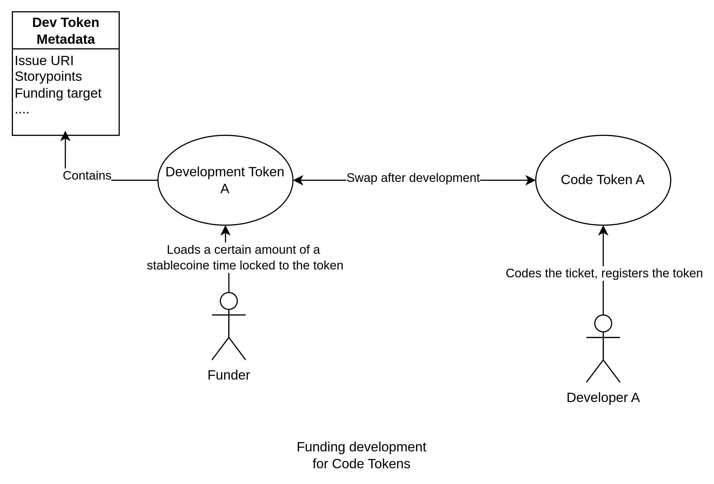

We see the possibilities with development tokens as manifold, and a first implementation is pragmatic, designed after the KISS principle and basic trust in the developer: Developers can mint a development story, create a funding target to develop, and then open it for funding, linking an issue in the issue tracking where they can prove they are developers. The incoming funds are collected in the NFT, and once the threshold is reached, development begins.

Later versions can define more complex scenarios depending on community feedback.

### Resulting Socio-Technological Key Features:

- **Identity Validation via Blockchain Means**: Normal identity Off-Chain Verification Providers can be used to verify contributors' accounts without the necessity of exposing concrete identities. In addition, Self-Sovereign Identity (SSI) Providers like [[Sovrin](https://sovrin.org/), [Civic](https://civic.me/), [What is a uPort identity?](https://medium.com/uport/what-is-a-uport-identity-b790b065809c)] allow users to control their identity data or only expose it when necessary. When combined with Ethereum, users can prove ownership without disclosing identity. 
- **Legal Contribution Ability**: Blockchain Services can provide a blockchain-based verification network where employment credentials or the permission to contribute are verified by issuers. Such verifiers can be identity-verified employers, educational institutions, trusted third parties who inspect employment contracts or tax documents for freelancers, etc. [[e.g., like Velocity Network](https://www.velocitynetwork.foundation/)]. The result of the legal contribution can then be stored by individuals in a digital wallet, removing certain risks for collaborating entities.
- **Security**: Blockchain's cryptographic security ensures that once a license or Code token is issued, its authenticity cannot be tampered with.
- **Transparency**: Every license transaction is recorded on the blockchain, providing a clear audit trail.
- **Authorship Recognition**: Out of the defined author/creator of the Code and the definable royalties for the author, the moral rights issues are solved.
- **Micro Fragment - Chain and Tree Licensing**: Licenses can now be issued for fragments or sole code snippets, creating completely new licensing options.
- **Financing Development**: Out of the capability to swap tokens, a funder finally gets motivation to fund development items, which creates a business model for developers. 
- **Flexibility**: Licenses can be transferred or resold in a secondary market, enhancing their value and utility. Combined with the issuance of licenses and the funding of development items, this creates completely new capitalization options in the development market.
- **Common Interest Community**: Out of the beneficiaries in the value chain, there is a shared common interest in prosecuting bad actors and avoiding them.
- **Interoperability**: Out of leveraged standards, all tokens can interact with other dApps or services for additional features.

---

## Tokenomics

By associating open-source projects with NFTs, it increases visibility and awareness of the projects, potentially attracting more funding, developers, and users who might not have engaged with traditional open-source platforms.

### Supply and Minting

- **Code Tokens/Licensables**: Shall be freely mintable without fees by all developers. In the first version, the minters will be only known individuals by the project team, where KYC principles were applied. This ensures compliance with regulatory frameworks and allows for a training process to open to public minting in later versions.

- **Granted Licenses**: Shall be freely mintable by everyone. Granted Licenses are minted, and the tokens are transferred to the specified wallet upon transaction completion. The minting fee is the license cost. While minting, the dependent artifacts are determined, and the beneficiaries (Code token owners) and license cost based on story points of the dependency tree is computed. The beneficiaries' creator/code author royalties are subtracted, the OCTL fee of 1% is charged, and the rest of the funds is split among the (Code token owners). In the first version, this GL minting will be only for known individuals by the project team where KYC principles were applied. 

- **Development Tokens**: Shall be freely mintable by everyone. In the first version, only developers can mint those. Funding of such tokens shall be open to everyone. 

### OCTL Development

At this moment, the OCTL fee of 1% goes to the creators of the OCTL and the smart contract implementations. 
It is planned to open the OCTL development and to add further contributors or a foundation here.

### Initial Funding and Bootstrapping

The first funding was covered by founders of the German company [[iunera.com](http://iunera.com)]. They created the OCTL out of personal motivation to share the source code of the Fahrbar20 project of the German Federal Ministry for Digital and Transport.

The initial version is a minimum viable product on the Arbitrum chain to go out and reach for feedback from the developer community to build next versions on top of it.

### Further Funding

The [[First NFT Jigsaw Puzzle with unique pieces](http://nftpuzzlepage.license-token.com)] serves a unique purpose within the context of supporting the OCTL:
There, a unique jigsaw puzzle of 9750 pieces is generated as SVG on top of the initial OCTL MVP license text and smart contract code. The unique thing about the picture is that the code and text are formatted as a shadow of the world map.
Each puzzle piece is unique through its jigsaw shape, carving out a special piece of the rendered initial MVP commit. 

The "puzzle" aspect involves breaking down larger pieces of art or even project components into smaller, collectible parts. Each puzzle piece could represent a part of a larger digital artwork or metaphorically represent pieces of a code project itself. In particular, it is a representation of how the OCTL license and blockchain framework itself works.

By supporting the OCTL creators with purchases and sales of these unique digital jigsaw NFT assets, they invest in the potential option of unique art which could gain in value with each project adopting the OCTL license. 

Ultimately, this way of bootstrapping and funding the project creators is in the whole spirit of the idea to stop begging for donations in open-source software and instead resolve the whole issue by providing value added for a puzzle or code procuring customer.

---

## Related Work

Even though the protocol seems at first unrelated to the software approach, we think it is highly related when it comes to the possibility of using stock photos for AI training.

### License based approaches
#### Dual Licensing
Dual Licensing means that the entity who owns the entire copyright can apply multiple licenses to the code. That means one can assign one commercial license to some people and the GPL/Apache License/MIT, etc., to everyone else. This is also a common tried and tested practice. Normally, a commercial license then offers fewer restrictions or additional rights for a fee [[MySQL Dual Licensing](https://www.mysql.com/about/legal/licensing/oem/)].  

#### Open Source Pledge
is a group of companies with a shared commitment to paying the maintainers of the Open Source software we all consume. The pledge's goal is to establish a new social norm in the tech industry of companies paying Open Source maintainers, so that burnout and related security issues such as those in XZ and Apache Log4j can become a thing of the past [[What is the Open Source Pledge?](https://opensourcepledge.com/about/#is-the-pledge-related-to-cryptocurrencies-in-any-way)]. The Open Source Initiative (OSI) Supports the Open Source Pledge [[The Open Source Initiative Supports the Open Source Pledge](https://opensource.org/blog/the-open-source-initiative-supports-the-open-source-pledge)], which ultimately leads to the restriction that supported license types of the Open Source Pledge need to be accepted by the OSI to ensure continued support.

Hence, the Open Source Pledge addresses a professionalization of donations for projects without the possibility of introducing licenses that demand compensation. Therefore, aside from dual-licensing projects funded by the Open Source Pledge are locked into continuing to use OSI-approved licenses without potentially losing the support of the Open Source Pledge. 

#### Fair Source Software (FSS) 
is a definition, governance, and classification of software licenses. FSS licenses have to define code as publicly available to read; allowed use, modification, and redistribution with minimal restrictions to protect the producer's business model; and undergo delayed Open Source publication (DOSP). The Fair Source Delayed Open Source Publication (DOSP) is the practice of distributing or publicly deploying software under a proprietary license at first, then subsequently and in a planned fashion publishing that software's source code under an Open Source license. [[About Fair Source](https://fair.io/about/)]

#### Fair Code
In contrast to the former, Fair Code describes only a software model where software is generally free to use and can be distributed by anybody, has its source code openly available and can be extended by anybody in public and private communities, and is commercially restricted by its authors. Fair-code attempts to create a level playing ground for software authors of all backgrounds, including those who would like to make a living off their work [[Fair Code](https://faircode.io/)].

### Blockchain concepts and implementations

#### Stock Licensing Protocol
Other entities have proposed to use the Ethereum Blockchain for licensing [[How to Develop an Ethereum Smart Contract for Licensing? | Apriorit](https://www.apriorit.com/dev-blog/557-ethereum-smart-contract-licensing)]. One of them is the Stock Licensing Protocol for selling stock licenses built with decentralized technologies. The protocol uses economic incentives to reward all protocol participants while instituting a more collaborative way for creators to sell their works to buyers via marketplaces. [[Token Economics - Stock Licensing Protocol](www.stocklicensingprotocol.com)].

#### Drips
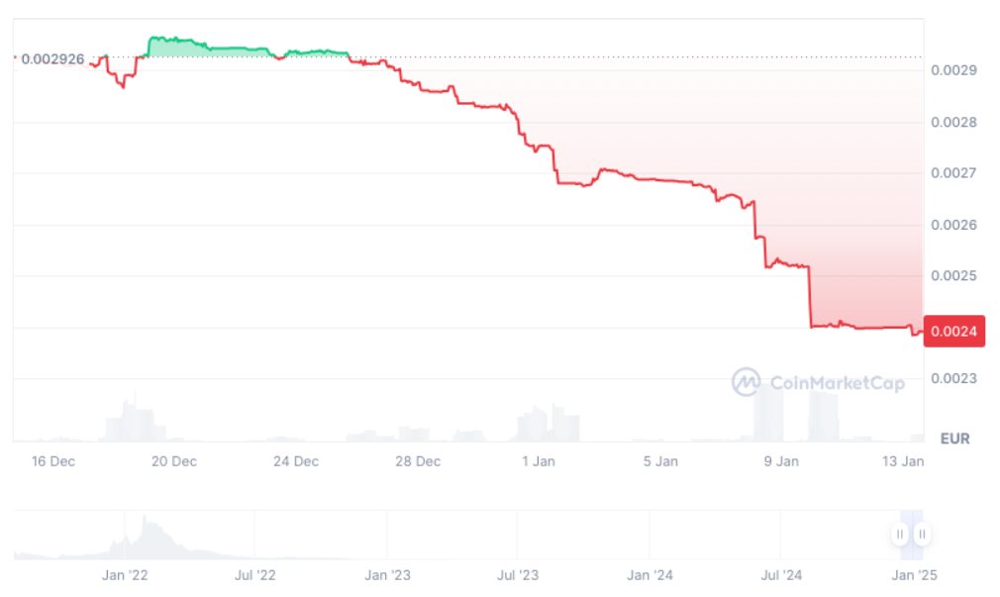]

Drips is an app built on Ethereum that enables flexibly supporting open-source projects with crypto tokens that are listed at crypto exchanges. The key idea is that each project defines dependency splitting for donations, and this creates a tree of how the donations in Drips are then distributed along the dependency tree. [[Drips homepage](https://docs.drips.network/)]. 

Ultimately, we see Drips as a Blockchain-based implementation that could be funded by mechanisms like the open-source pledge with its own crypto token. While still, donations are not a business model, one can see a very efficient way to distribute funds via Drips. The problematic aspect for non-crypto projects is likely the fluctuation between the DRIPS token and ordinary money that is required in normal projects.

#### Cryptolens
This service utilizes blockchain to manage software licenses, focusing on ease of integration, security, and analytics  [[Cryptolens homepage](https://cryptolens.io)]. Their approach underscores the potential for blockchain to simplify license tracking, combat piracy, and ensure compliance through a decentralized ledger.

#### Gitcoin
Known for its grants and bounties system, Gitcoin uses blockchain to fund open-source work [[Gitcoin](https://gitcoin.co/)], which could be seen as a precursor to incentivizing development through tokenized licenses, similar to the funding mechanisms in License-Token.com.

#### Radicle
Aims to decentralize software collaboration and funding, offering a peer-to-peer stack for codebases that might be integrated or inspire similar functionalities in a token-based licensing ecosystem[[Radicle](https://radicle.xyz/)]. However the focus of Radicle is absolute anonymity and beeing cencorship resistant what is partially an not aligning to License-token.com. 

#### License.Rocks
Aims at tokenizing software licenses to prevent loss or mismanagement [[License.Rocks](https://license.rocks/)], offering a model that could be extended to the broader concept of license tokenization proposed by License-Token.com.

#### BountySource
While not strictly focused on licensing, BountySource uses a bounty system for funding open-source projects, which shares similarities with License-Token.com's Development Stories for sponsored development  [[BountySource](https://www.bountysource.com/)].

#### Accenture's DLT-based Software Asset Management Tool 
Accenture has explored the use of Distributed Ledger Technology (DLT) for managing software assets [[Accenture Blog](https://www.accenture.com/us-en/blogs/blogs-blockchain-software-asset-management)], which aligns with License-Token.com's goal of transparency and efficiency in license management. Their tool provides insights into how blockchain can streamline software license tracking and auditing.

#### IBM's Blockchain for Licensing
IBM has explored blockchain applications in various fields, including licensing [[IBM Blockchain](https://www.ibm.com/blockchain)]. Their case studies and whitepapers might offer practical insights into implementing blockchain solutions for license management.

#### Microsoft's Azure Blockchain for IP Management
Microsoft's efforts in using blockchain for managing intellectual property [[Azure Blockchain](https://azure.microsoft.com/en-us/solutions/blockchain/)] could provide examples of corporate adoption and scaling of such technologies.

#### Academic research anc concepts
Researchers from the Harvard university focus on the legal side how blockchain might interact with intellectual property laws, what is crucial for long term sustainability [[Research on Blockchain and IP Law, The Berkman Klein Center for Internet & Society at Harvard University](https://cyber.harvard.edu/)].

technical research examines the application of blockchain (NFTs) to improve software license management and introdcues concepts similar to Code Tokens, Granted Licenses and royalty distributions in License-Token [[Blockchain for Software License Management](https://www.researchgate.net/publication/357892345_Blockchain_for_Software_License_Management)], [[Blockchain-Based Model for Software Licensing](https://www.researchgate.net/publication/355393212_Blockchain-Based_Model_for_Software_Licensing)]
. 

Other research addressing compliance, permissions and enforcement issues of open-source licenses [[An Approach to Open-Source Software License Management using Blockchain-based Smart-Contracts](https://ieeexplore.ieee.org/document/9215059)]

Concepts for EOS and Ethereum smart contracts for licensing discuss how one can automate license distribution and subscription, which is akin to the smart contract functionalities in License-Token.com's system [[Software Licensing with Blockchain using EOS Smart Contracts](https://arxiv.org/abs/1907.08645)], [[Blockchain-Based Software Subscription and Licenses Management System](https://www.sciencedirect.com/science/article/pii/S0167739X19322165)].

A study proposes a decentralized licensing model using NFTs, which closely mirrors the concept of Code Tokens and Granted Licenses in License-Token.com   [[Lee, B., & Park, H., 2021. *International Conference on Blockchain and Cryptocurrencies*](https://www.researchgate.net/publication/355393212_Blockchain-Based_Model_for_Software_Licensing)]. It emphasizes the potential for automatic royalty distribution and protection against unauthorized use.

[[EBSI](https://ec.europa.eu/cefdigital/wiki/display/CEFDIGITAL/EBSI)]: While primarily focused on cross-border services, The European Blockchain Services Infrastructure (EBSI)'s approach to using blockchain for verifiable credentials can be paralleled with verifying intellectual property or licensing rights, offering insights into compliance and interoperability in Europe. This is related and revelant to source code, because in special patents could be manifested in code. Linking IP artifacts to code tokens can increase the efficency and legal security of our framework in the future.

### Conclusion
Dual licensing is popular for many developers due to the necessity to publicize some source code to the community while holding back some code for commercial use. We believe that the OCTL can lower the exploitation risks for these developers, and as long as a project is owned by a single entity, they simply can apply the OCTL in addition to other licenses.

Fair code seems to be very aligned with the goals and principles of the OCTL, and we plan to explore synergies here in the future. 

Fair Source Software focuses on a few principles that the OCTL does not fulfill at the moment. Here, we focus on collecting feedback from adopting projects if they would desire such a classification.

For Drips and the Open Source Pledge, we see common goals in empowering developers to be compensated for their work. Here, we will also reach out for collaboration and hope that the institutions behind think in a collaborative rather than competitive mode to empower developers.

The approaches and academic research underlines the potential of blockchain in software licensing. All approaches collectively suggest that blockchain can revolutionize licensing is done. Ultimately, we believe it is also worthwhile to reach out to the academic esearchers as well as the related blockchain projects to explore synergies and gain feedback. We beleive that software is built together and in this spirit the related approaches shall be looked at. 

We see the related work as overall motivation that License-Token.com's vision builds upon these prior insights, aiming to create a more sustainable ecosystem for open-source and proprietary software through innovative tokenization and smart contract technologies. Ultimately, we see our approach not as competition but as a contribution and offer for collaboration with other projects to disrupt the current open source ecosystem and making it more sustainable.

---

## Implications and Market Potential

With our approach, we believe we support specialization and unlock completely new market potentials.
### Vision
Imagine a coder could only focus on utilizable software without the necessity to operate a SaaS Solution, apply for Open Source funding, or similar. As long as the code artifacts are useful, they are applied, and the developer receives royalties in a fair way. Even the license distribution can be separated from the code, or the work can be funded with development tokens. 
Everybody can focus on what they do best: a funder on what to fund, a coder on coding, and a marketer on selling licenses.

All in all, we believe that even our model can serve as a foundation for enterprises to motivate their open-source coders and to win the best talent.

Hence, we believe this vision creates a value added that goes beyond the sum of the parts of our solution.

### Direct potential
As direct implications and consequent actions of our concept and solution, we see the following points:

- **Jurisdiction**: Our operations initially focus on jurisdictions with clear regulations. Thereby, we focus on crypto-friendly countries which respect and adhere to copyright laws. This unlocks the largest market potential.

- **Regulatory Potential**: Due to our approach using NFTs and, therefore, not being security token-based, our approach seems safe to use in most regulated jurisdictions where NFTs are not seen as securities. We adhere to existing copyright laws and will work towards compliance with emerging regulations concerning digital assets and smart contracts that we cover in our approach. Therefore, we assume, combined with regulation, that our approach can be used to capitalize on fair code development in most developed markets in new ways. This gives it enormous market potential with regulatory safety.

- **Impact for Open Source, Fair Code**: New ways of development funding, royalties, (micro) code licensing, forking collaboration, ownership transfer, and coder effort attribution create completely new possibilities for source-available business models based on fair code principles. Ultimately, our approach can create a completely new marketplace for software and open collaborative development. 

- **Market Potential in Licensing**: With the growing acceptance of blockchain and NFTs, the market for tokenized software licenses is poised for significant growth, aligning with trends in digital asset ownership and trading.

- **10X NFT Market Extension**: Our approach expands and manifolds the NFT marketplaces with new actors and beneficiaries. Bringing NFTs and tokenization of assets to completely new spheres by a large market of addressable actors. These include millions of independent software developers, professional software vendors, and end-users in various sectors requiring software licensing solutions. This kind of market extension for NFTs could seed a new super cycle for NFTs and related use cases, ultimately leading to mass adoption of blockchain technology in an industry sector.  

---

## Roadmap

- **Q1 2024**: Initial development 
- **Q2 2024**: Initial development 
- **Q3 2024**: Initial deployment and on-chain testing. Deployment and Application on the first OCTL project On-Chain. 
- **Q4 2024**: Collection of expert feedback from the software industry and identifying the most profitable sectors. 
- **Q1 2025**: Establishing industry partnerships and cooperating projects.
- **Q2 2025**: Full launch of an extended funding campaign with the funding jigsaw puzzle. 
- **Q3 2025**: Full marketplace functionality for trading code tokens. First marketplace functionality for Granted License Tokens. 
- **Q4 2025**: Incorporation of feedback from partners
- **Q1 2026**: Granted License procurement with stablecoins.
- **Q2 2026**: Incorporation of feedback from partners. Anonymous contributions and options for developer verification.

---

## Conclusion

License-Token.com introduces a transformative approach to software licensing and developer compensation, utilizing blockchain technology, specifically NFTs and smart contracts on the Ethereum/Arbitrum network. The Open Compensation Token License (OCTL)] redefines the landscape of fair software, addressing its sustainability and funding:

- **Sustainability and Compensation**: Traditional OSS models often rely on donations, grants, or indirect benefits, which are insufficient for many projects' sustainability. License-Token.com disrupts this by introducing a direct, tokenization royalty system, making public code projects more viable and less dependent on sporadic funding. This could shift the paradigm from open-source as a fair code way. This not only aligns with fair source ethos but enhances it by providing a clear, transparent mechanism for compensation when software is commercially exploited, potentially attracting more developers to adopt fair code practices. With such a fair code system, developers can build careers, thus enriching the public code ecosystem with more high-quality, maintained projects. This model can potentially reduce the 95% abandonment rate of projects by providing a financial incentive for ongoing development and maintenance, thus fostering sustainable innovation.

- **Innovative Funding Model**: The platform's use of Development Stories NFTs for funding introduces a novel approach where sponsors can directly invest in specific features or milestones, with the assurance that their investment translates into tangible software enhancements, where then a declared royalty portion can be given to the funder. This model could revolutionize how software projects are funded, making it more appealing for both developers and investors to invest in advancing and publishing code.

- **Market Expansion and NFT Growth**: By tokenizing licenses, copyrights, royalties, and funding, License-Token.com not only opens up new markets for software monetization but also potentially expands the NFT market into software licensing. This could lead to a 'super cycle' for NFTs, as the software industry represents a massive, untapped market for digital asset trading. The growth potential is significant, aligning with the projected expansion of the NFT market at a CAGR of 34.2% from 2024 to 2030.

- **Security, Trust, and Transparency**: Blockchain's inherent security features ensure that once a license or token is issued, its integrity is maintained, reducing piracy and enhancing trust in software distribution. This transparency could lead to broader adoption of digital licensing, making software markets more secure and trustworthy.

- **Community and Collaborative Development**: By creating a shared economic interest through royalties and token trading, License-Token.com encourages a collaborative environment where contributors are financially motivated to participate, potentially leading to richer, more sustainable software ecosystems.

- **Developer Anonymity, Verification, Mitigated Copyright Violations**: The platform is capable of protecting contributor privacy while still allowing compensation. This anonymity can be achieved by distributed trust networks. It is even possible to enable anonymous contributors who are accredited to own the rights on their works by distributed verification networks, mitigating copyright violations.  

- **Regulatory Compliance and Market Potential**: By focusing on jurisdictions with clear crypto regulations and NFTs which represent unique artifacts, the initiative ensures compliance, making it viable in developed markets and thus expanding its reach and impact.

In summary, License-Token.com disrupts the current open-source and fair-source models by introducing sustainability through economic incentives. This could not only revitalize the open/available/fair source or code community but also integrate into mainstream software development, leveraging blockchain to ensure creators are rewarded, innovation is incentivized, and the entire ecosystem thrives. 

---

## FAQ
This is a collection of the most common questions, we get asked.

### What is the benefit of the OCTL over another copyleft license?
What is the benefit of choosing the OCTL license over a copyleft license and then just licensing customers with a commercial license individually?  
What is the benefit of the OCTL license over classical Open Source Dual Licensing?

In short, with the OCTL, everybody can fork your code, and then customers can license the additions to the code and your foundation through the blockchain easily. The key thing is that everybody can openly develop further with your code. The development on top of other code is free.

Example: A develops. B stacks on top, and C procures the code of B.  
Effect: With the OCTL, when the license for B is generated, A is compensated automatically.

### Exploitative business practices are the key problem, why should a new license help?
Exploitative business practices are the problem, not permissive licenses - how should this license help?

Agreed to a certain extent.  
Patents are also public, but allow legal prosecution.  
Proving ownership and allowing everybody to stack on top creates a community that is interested in the prosecution of violators.  
Illegal copies can still exist - there you are correct, but at least they can be prosecuted.

### How does the implementation work simplified?
Our first implementation works as follows:  
- Commits or versions are represented by a non-fungible token (proof of ownership NFTs).  
- Commercial usage licenses are issued via smart contracts for the non-fungible tokens.  
- Smart contracts distribute the license funds to the NFT holders.

### Can I use OCTL alongside other open-source licenses and dual license? Is there a risk?
As long as you own the copyright of the code (so it is your own code), you can apply OCTL alongside other open-source licenses and dual license. Also, commercial licenses that do not prohibit dual- or multi-licensing can be applied alongside. This way, one project can start applying the OCTL in a lean way with minimal or no risk.

### How does the smart contract manage compensation for code contributors?
The smart contract automatically manages compensation by:
- Calculating the license fee based on the 'story points' associated with each Code Token, representing the development effort.
- Distributing funds to the holders of the corresponding Code Tokens when a Granted License is issued, including creator royalties if set by the original developer. 

### This is all crypto hocus pocus and no real money
The first version of the OCTL de facto uses an exchange rate of Ethereum to the USD dollar to keep the minimum viable product lean. However, later versions will use stablecoins like USDT to avoid currency fluctuations.

### The OCTL is not open-source, not fair source, or whatever
One can now argue that the OCTL is not open source, fair source, or fair code because of terminology wars over non-trademarked terms. Whether the OCTL is available code, public code, open development, a proprietary license, fair code, fair source, open source code, or whatever, in any case, we see the OCTL as a mechanism to help get developers paid who share their work for further developments.

Hence, we ask all people who feel offended by terminologies to see that we do not care about the terms and rather focus on getting new mechanisms in place to get developers paid for their work fairly.

### How does OCTL address the sustainability of projects?
It creates sustainability by creating a direct revenue stream for developers through royalties on commercial use, reducing dependency on donations or grants.
This encourages ongoing maintenance and development since contributors are financially motivated to keep projects up-to-date and secure.

### How can one support the OCTL development?
- **Funding**: Participate in the funding mechanism by purchasing unique NFT jigsaw puzzle pieces [[NFT supporter Puzzle homepage](https://nftpuzzle.license-token.com/)][[NFT sale on OpenSea](https://opensea.io/collection/octl-puzzle)], which supports the creators of OCTL.
- **Collaboration**: Developers can contribute to the project's GitHub repository or participate in community feedback sessions.
- **Adoption**: Use OCTL for your projects, promoting its use within the broader developer community.

### How does OCTL help in creating new business models for software development?

- **Tokenization of Code**: Developers can tokenize parts of their software, creating new markets for licensing and trading these tokens.
- **Blockchain-based licensing**: Blockchain-based licenses can be traded on marketplaces or even used for access control. This allows a secondary license market where licensors can resell licenses from which the code token holders can receive royalty payments.   
- **Micro-licensing**: Allows for micro-fragmentation of licenses, enabling developers to monetize even small snippets of code.
- **Development Funding**: Development Stories allow for direct funding of new features or modules, creating a bounty system where funders invest in specific development tasks.

### What are the implications of OCTL for the NFT market expansion?
It extends the use of NFTs beyond art and collectibles into practical software licensing. In particular, the OCTL could significantly expand the NFT market by introducing millions of developers and software users as new actors.

### What are the steps to integrate my existing project with OCTL?
**Remark**: Please contact the OCTL team to apply it at the current moment because we need feedback to improve. 
We will also guide you through the process to apply the OCTL to your project; please email augmenta@license-token.com

The process we will apply the OCTL together is the following:

1. **License Application**: Developers can apply OCTL to their code like any other license.
2. **Token Minting**: Mint Code Tokens for a URI (or UUID) that you specify in the code files or for a commit ID. 
3. **Community Engagement**: Inform your community about the change and how they can benefit from or contribute to your OCTL-licensed project.
4. **Documentation**: Update your project documentation to include instructions on how to procure Granted Licenses for commercial use.

### The current model of the OCTL is pure supply side pricing - why is that?
We are at the beginning and think this is the right way, because demand based pricing is more complicated. 
We have some concepts in mind how to improve the pricing to demand side, but we need community size to get the necessary feedback to do it the correct way. 

### This is all so complicated - can't you make that simpler?
Hopefully, we hope for a lot of feedback that we see which use cases and really matter to make things easy.

### I want feature XYZ; Why do you not support ZXY 
Rome was not built in a day and also not alone. 
We are open for constructive feedback and suggestions and projects and people who want to collaborate.

### Bad actor attacks to the concept
We identified scenarios where bad actors could try to abuse the system for increased personal gain.
For such cases, we are working on validation mechanisms. E.g. that story points are verified by issued licenses and Code token graphs that show collaborations in the past. Agian, we need feedback, community and collaboration to advance our concepts.

---

## References

- [Open Source Software: The $9 Trillion Resource Companies Take for Granted - Harvard Business School](https://www.library.hbs.edu/working-knowledge/open-source-software-the-nine-trillion-resource-companies-take-for-granted/)
- [GitHub's State of the Octoverse 2022](https://octoverse.github.com/2022/top-programming-languages)
- [Linux Foundation Projects](https://www.linuxfoundation.org/projects/)
- [Apache Projects](https://projects.apache.org/)
- [Eclipse Projects](https://projects.eclipse.org/)
- [CNCF Projects](https://www.cncf.io/projects/)
- [Mozilla Projects](https://www.mozilla.org/en-US/foundation/moss/)
- [OSGeo Projects](https://www.osgeo.org/projects/)
- [Understanding Open Source Licenses - Open Source Initiative](https://opensource.org/licenses)
- [What Makes a Successful Open Source Project? - Apache Software Foundation](https://www.apache.org/foundation/how-it-works.html)
- [Joining the Linux Foundation](https://www.linuxfoundation.org/projects/joining/)
- [CNCF Project Proposal Process](https://github.com/cncf/toc/blob/main/process/project_proposals.adoc)
- [Eclipse Development Process](https://www.eclipse.org/projects/dev_process/development_process.php)
- [Mozilla's Mission and Principles](https://www.mozilla.org/en-US/mission/)
- [Best Practices for Open Source Development - GitHub](https://opensource.guide/best-practices/)
- [The Value of Open Source Software is More than Cost Savings](https://www.linuxfoundation.org/blog/the-value-of-open-source-software-is-more-than-cost-savings/)
- [Open Source Software Creators: It’s Not Just About the Money | NBER](https://www.nber.org/digest/jul14/w20055.html)
- [Fong, C. M. (2011). Social Preferences, Self-Interest, and the Demand for Redistribution. *Journal of Public Economics*, 95(7-8), 628-638.](https://www.sciencedirect.com/science/article/abs/pii/S0047272711000135)
- [Andreoni, J. (1990). Impure Altruism and Donations to Public Goods: A Theory of Warm-Glow Giving. *The Economic Journal*, 100(401), 464-477.](https://www.jstor.org/stable/2234133)
- [Sargeant, A., Ford, J. B., & West, D. C. (2001). Perceptual Determinants of Nonprofit Giving Behavior. *Journal of Business Research*, 54(1), 25-35.](https://www.sciencedirect.com/science/article/abs/pii/S0148296399000945)
- [Bekkers, R., & Wiepking, P. (2011). A Literature Review of Empirical Studies of Philanthropy: Eight Mechanisms That Drive Charitable Giving. *Nonprofit and Voluntary Sector Quarterly*, 40(5), 924-973.](https://journals.sagepub.com/doi/abs/10.1177/0899764010380927)
- [Slack's Freemium Model](https://slack.com/pricing)
- [GitHub's Pricing](https://github.com/pricing)
- [MongoDB's Open Core Strategy](https://www.mongodb.com/blog/post/mongodb-open-core-strategy)
- [Elastic's Business Model](https://www.elastic.co/blog/elastic-business-model)
- [Is it a good idea to build an Open Source Simple Analytics alternative?](https://www.indiehackers.com/post/is-it-a-good-idea-to-build-an-open-source-simple-analytics-alternative-604cbb6edb)
- [Red Hat's Business Model](https://www.redhat.com/en/about/business-model)
- [Canonical's Support Offering](https://canonical.com/services)
- [There is Still NO Open Source Business Model](https://medium.com/@stephenrwalli/there-is-still-no-open-source-business-model-8748738faa43)
- [Mozilla's Advertising Experiments](https://blog.mozilla.org/blog/2019/02/21/firefox-now-offers-more-choices-for-tracking-protection/)
- [Employment Law in Germany: In-depth](https://app.croneri.co.uk/topics/employment-law-germany/core-areas)
- [Parker, S. (2022). *Community Review as a Quality Assurance Mechanism*. Software Quality Journal.](https://example.com/parker2022)
- [White, E. (2022). *Tools for Managing Code Snippet Licenses*. Proceedings of the International Conference on Software Engineering.](https://example.com/white2022)
- [Smith, R. (2020). *Monetizing Code through Licensing Models*. Software Economics.](https://example.com/smith2020)
- [Johnson, K., & Lee, H. (2021). *SaaS Models for Code Sharing Platforms*. Business Innovation Journal.](https://example.com/johnsonlee2021)
- [MySQL Dual Licensing](https://www.mysql.com/about/legal/licensing/oem/)
- [What is the Open Source Pledge?](https://opensourcepledge.com/about/#is-the-pledge-related-to-cryptocurrencies-in-any-way)
- [The Open Source Initiative Supports the Open Source Pledge](https://opensource.org/blog/the-open-source-initiative-supports-the-open-source-pledge)
- [About Fair Source](https://fair.io/about/)
- [Fair Code](https://faircode.io/)
- [How to Develop an Ethereum Smart Contract for Licensing? | Apriorit](https://www.apriorit.com/dev-blog/557-ethereum-smart-contract-licensing)
- [Token Economics - Stock Licensing Protocol](www.stocklicensingprotocol.com)
- [Drips homepage](https://docs.drips.network/)
- [Cryptolens.io](https://cryptolens.io)
- [Gitcoin](https://gitcoin.co/)
- [Radicle](https://radicle.xyz/)
- [License.Rocks](https://license.rocks/)
- [BountySource](https://www.bountysource.com/)
- [Accenture Blog](https://www.accenture.com/us-en/blogs/blogs-blockchain-software-asset-management)
- [IBM Blockchain](https://www.ibm.com/blockchain)
- [Azure Blockchain](https://azure.microsoft.com/en-us/solutions/blockchain/)
- [Research on Blockchain and IP Law, The Berkman Klein Center for Internet & Society at Harvard University](https://cyber.harvard.edu/)
- [Blockchain for Software License Management](https://www.researchgate.net/publication/357892345_Blockchain_for_Software_License_Management)
- [Blockchain-Based Model for Software Licensing](https://www.researchgate.net/publication/355393212_Blockchain-Based_Model_for_Software_Licensing)
- [An Approach to Open-Source Software License Management using Blockchain-based Smart-Contracts](https://ieeexplore.ieee.org/document/9215059)
- [Software Licensing with Blockchain using EOS Smart Contracts](https://arxiv.org/abs/1907.08645)
- [Blockchain-Based Software Subscription and Licenses Management System](https://www.sciencedirect.com/science/article/pii/S0167739X19322165)
- [EBSI](https://ec.europa.eu/cefdigital/wiki/display/CEFDIGITAL/EBSI)

---

## Disclaimer
This whitepaper is for informational purposes only and does not constitute an offer or solicitation to buy or sell any securities or tokens or to apply the OCTL license to your project. Always conduct your own due diligence.